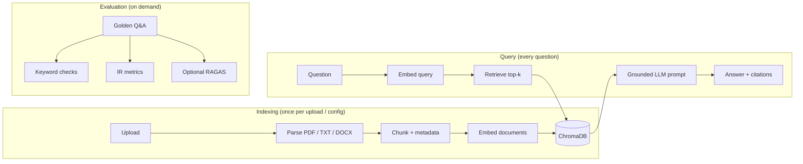

<p align="center">
  
</p>

<h1 align="center">QABot</h1>

<p align="center">
  <strong>Ask questions over your documents. Get grounded answers with citations.</strong><br />
  A production-minded Streamlit RAG demo — tunable chunking, persistent ChromaDB, and three-layer evaluation.
</p>

<p align="center">
  <a href="https://github.com/wasimahmadpk/qabot"></a>
  
  
  
  
  
  
</p>

<p align="center">
  <a href="https://github.com/codespaces/new?hide_repo_select=true&ref=main&repo=wasimahmadpk/qabot"></a>
</p>

---

**QABot** is a [retrieval-augmented generation (RAG)](https://docs.llamaindex.ai/en/stable/understanding/rag/) app for teams who want more than a hello-world tutorial. Upload PDF, TXT, or DOCX files, ask questions in natural language, and get **grounded answers with inline `[file_name, chunk_id]` citations**. Vectors persist in **ChromaDB**; embeddings and answers use **OpenAI** via **LlamaIndex**.

| | |
|---|---|
| **Ask tab** | Upload docs, index into ChromaDB, query with citations |
| **Evaluate tab** | Score retrieval and answer quality with keyword, IR, and optional RAGAS metrics |
| **Built-in demo** | 500-line sample handbook + 10 golden Q&A pairs (including a refusal test) |
| **Headless-ready** | `src/` pipeline is UI-agnostic — same modules can back an API or MCP server |

### Quick start

```bash
git clone https://github.com/wasimahmadpk/qabot.git && cd qabot
python -m venv venv && source venv/bin/activate
pip install -r requirements.txt
echo "OPENAI_API_KEY=sk-your-key-here" > .env
streamlit run app.py
```

Open `http://localhost:8501`, upload `eval/sample_policy.txt` (downloadable from the **Evaluate** tab), and ask *"How many remote days per week are allowed?"*

> **No local setup?** Click **Open in GitHub Codespaces** above, add `OPENAI_API_KEY` as a Codespaces secret, and the dev container installs dependencies and starts Streamlit automatically.

## Table of contents

- [Why QABot?](#why-qabot)
- [Tech stack](#tech-stack)
- [Features](#features)
- [Architecture](#architecture)
- [Prerequisites](#prerequisites)
- [Installation](#installation)
- [Demo walkthrough](#demo-walkthrough)
- [Example output](#example-output)
- [RAG settings](#rag-settings)
- [Evaluation](#evaluation)
- [OpenAI models](#openai-models)
- [Programmatic usage](#programmatic-usage)
- [Project structure](#project-structure)
- [Tests](#tests)
- [FAQ](#faq)
- [Troubleshooting](#troubleshooting)
- [Design decisions](#design-decisions)
- [Limitations & roadmap](#limitations--roadmap)
- [Dev container](#dev-container)
- [Contributing](#contributing)

## Why QABot?

Most RAG tutorials stop at "ask a question, get an answer." QABot is built for **experimentation and regression testing**:

| Typical RAG demo | QABot |
|------------------|-------|
| Re-indexes on every restart | **Persistent ChromaDB** keyed by upload signature + chunk config |
| Fixed chunk size | **Tunable** strategy, size, overlap, and top-k from the sidebar |
| Answers with no sources | **Grounded prompts** with `[file_name, chunk_id]` citations and explicit refusal |
| No way to measure quality | **Three eval layers** — keyword checks, IR metrics (Recall@k, MRR, NDCG@k), optional RAGAS |
| UI tightly coupled to logic | **`src/` modules** usable from scripts, APIs, or other frontends |

### Use cases

- **Policy & handbook Q&A** — employees ask HR or IT questions against internal docs
- **RAG prototyping** — tune chunk size, overlap, and top-k without writing boilerplate
- **Regression testing** — measure retrieval ranking and answer quality before shipping prompt or config changes

## Tech stack

| Layer | Technology |
|-------|------------|
| UI | [Streamlit](https://streamlit.io/) |
| RAG framework | [LlamaIndex](https://www.llamaindex.ai/) |
| Vector store | [ChromaDB](https://www.trychroma.com/) (persistent, local) |
| Embeddings & LLM | [OpenAI](https://platform.openai.com/) (LlamaIndex defaults) |
| Document parsing | PyMuPDF (PDF), python-docx (DOCX), plain text |
| Evaluation | Keyword checks, IR metrics, optional [RAGAS](https://docs.ragas.io/) |

## Features

- **Multi-file upload** — index several documents in one session (`.pdf`, `.txt`, `.docx`)
- **Tunable RAG settings** — chunk strategy, size, overlap, and top-k from the sidebar
- **Sentence-aware chunking** — respects sentence boundaries by default; token-based splitting also available
- **Grounded prompts** — answer only from retrieved context; cite `[file_name, chunk_id]`; say "I don't know" when evidence is missing
- **ChromaDB persistence** — vectors survive app restarts for the same upload + config signature
- **Upload caching** — SHA-256 signature skips re-embedding when files and chunk settings are unchanged
- **Three-layer evaluation** — fast keyword checks, IR metrics (Recall@k, MRR, NDCG@k), and optional RAGAS LLM-as-judge scoring
- **Custom eval sets** — upload, edit, or reset evaluation JSON without leaving the app
- **Sample questions** — dropdown on the Ask tab for quick smoke tests

## Architecture

QABot has three distinct phases. **Indexing** runs when you upload files or change chunk settings. **Querying** runs on every new question and does not re-parse, re-chunk, or re-embed your documents. **Evaluation** runs on demand against a golden Q&A set.



| Step | Module | Role |
|------|--------|------|
| Config | `src/rag_config.py` | Defaults for chunk size, overlap, strategy, top-k; stable index keys |
| Load | `src/loader.py` | Parse PDF (PyMuPDF), TXT, DOCX into LlamaIndex `Document` objects |
| Chunk | `src/chunking.py` | Split documents with overlap; attach `file_name` and `chunk_id` metadata |
| Index | `src/indexer.py` | Embed chunks and persist in ChromaDB (`./chroma_db/`) |
| Prompt | `src/prompts.py` | Grounded QA templates (anti-hallucination rules + citations) |
| Query | `src/query_engine.py` | Retrieve, answer, return latency and source chunks |
| Eval | `src/evaluation.py` | Golden Q&A metrics for retrieval and answer quality |
| Cache | `src/upload_cache.py` | SHA-256 upload signature so unchanged files skip rebuild |

At query time, only the **user's question** is embedded. Stored document vectors are read from ChromaDB.

## Prerequisites

- **Python 3.10+** (3.11 recommended; matches the dev container)
- **OpenAI API key** with access to embeddings and chat completions
- **~2 GB disk** for Python dependencies (includes PyTorch and sentence-transformers pulled in by RAGAS)

## Installation

### 1. Clone and install

```bash
git clone https://github.com/wasimahmadpk/qabot.git
cd qabot

python -m venv venv
source venv/bin/activate          # Windows: venv\Scripts\activate

pip install -r requirements.txt
```

### 2. Configure OpenAI

Create a `.env` file in the project root:

```env
OPENAI_API_KEY=sk-your-key-here
```

The sidebar shows **API connected** (green) when the key is loaded. No other environment variables are required.

| Variable | Required | Purpose |
|----------|----------|---------|
| `OPENAI_API_KEY` | Yes | Embeddings, answer generation, and optional RAGAS judge calls |

> **Security:** Never commit `.env` or API keys. The `.env` file is gitignored by default.

### 3. Run the app

```bash
streamlit run app.py
```

Open the URL shown in the terminal (usually `http://localhost:8501`).

## Demo walkthrough

Try the built-in sample in under two minutes:

1. **Start the app** — `streamlit run app.py`
2. **Upload** — on the **Ask** tab, upload `eval/sample_policy.txt` (or download it from the **Evaluate** tab → **Eval set & downloads**)
3. **Wait for indexing** — the sidebar shows doc and chunk counts when ready
4. **Ask** — pick a sample question from the dropdown or type your own, e.g. *"How many remote days per week are allowed?"*
5. **Test refusal** — ask *"What is the capital of France?"* — the model should reply *"I don't know"* (no evidence in the handbook)
6. **Evaluate** — switch to **Evaluate**, click **Run evaluation** for keyword + IR metrics, or **Run RAGAS** for LLM-as-judge scoring

Each new question reuses the stored index. Documents are not re-embedded unless you upload new files or change chunk settings.

## Example output

After indexing `eval/sample_policy.txt` and asking *"How many remote days per week are allowed?"*:

```
All employees may work remotely up to three days per week [sample_policy.txt, 2].

847 ms · 3 sources
```

Expand **Sources** to inspect the retrieved chunks — each shows `file_name`, `chunk_id`, similarity score, and the raw chunk text. This makes it easy to verify that answers are grounded in your documents rather than model memory.

## RAG settings

Controls live in the sidebar under **Advanced settings** (collapsed by default):

| Setting | Default | Range | Notes |
|---------|---------|-------|-------|
| Chunk strategy | `sentence` | `sentence`, `token` | `sentence` respects boundaries; `token` uses fixed token windows |
| Chunk size | 512 | 128–4096 | Target tokens per chunk; triggers re-indexing when changed |
| Chunk overlap | 128 | 0–1024 | Shared tokens between neighboring chunks; triggers re-indexing when changed |
| Top-k | 3 | 1–15 | Chunks retrieved per question; applies immediately without re-indexing |

Changing chunk settings creates a new ChromaDB collection keyed by upload signature + config. Use **Reset defaults** to restore defaults.

### Chunking strategies

| Strategy | Splitter | Behavior |
|----------|----------|----------|
| `sentence` (default) | LlamaIndex `SentenceSplitter` | Splits at sentence boundaries up to the chunk size |
| `token` | LlamaIndex `TokenTextSplitter` | Fixed token windows; may cut mid-sentence |

Each chunk receives metadata:

- `file_name` — source document
- `chunk_id` — sequential ID within that file (used in citations and optional IR eval)

Short documents that fit within the chunk size stay as a single chunk. Overlap (default 128 tokens) reduces the risk of losing context at chunk boundaries.

## Evaluation

The eval suite runs golden questions from `eval/qa_pairs.json` (10 questions by default, or a custom set). You build the set yourself — each item is a question plus signals for what a good answer looks like.

### Three evaluation layers

| Layer | Button | Cost | What it measures |
|-------|--------|------|------------------|
| **Keyword** | Run evaluation | Low (1 LLM call per question) | End-to-end retrieval + answer checks |
| **IR** | Run evaluation | None (retrieval only) | Ranking quality: Recall@k, MRR, NDCG@k |
| **RAGAS** | Run RAGAS | High (extra judge LLM calls) | Faithfulness, answer relevancy, context recall |

### Keyword metrics (end-to-end)

These run the full RAG pipeline (retrieve + generate) and check results against `expected_keywords`.

| Metric | Meaning |
|--------|---------|
| **Retrieval hit rate** | Did retrieved chunks contain all expected keywords? |
| **Grounded answer rate** | Did the answer contain expected keywords **and** retrieval succeeded? (refusal items only check the answer) |
| **Avg latency** | End-to-end query time in milliseconds |

**Grounded** is intentionally stricter than a plain keyword match in the answer — if retrieval failed but the answer still contains the keywords, that counts as **not grounded** (possible hallucination). Out-of-scope questions use `"refusal": true` and only check that the model refused.

### IR metrics (pure retrieval)

Computed from ranked top-k retrieval via `retrieve_ranked()` — **no LLM calls**. All three metrics share the same `top_k` from sidebar settings. Refusal questions are excluded from IR averages.

| Metric | Meaning |
|--------|---------|
| **Recall@k** | Did top-k results include relevant chunk(s)? With `relevant_chunk_ids`, this is the fraction of labeled chunks found |
| **MRR** | Reciprocal rank of the first relevant chunk (1.0 at rank 1, 0.5 at rank 2, 0 if none) |
| **NDCG@k** | Normalized ranking quality — rewards placing relevant chunks higher in the list |

A chunk is **relevant** when it contains all `expected_keywords` (or matches a `relevant_chunk_ids` entry).

### RAGAS metrics (optional)

Click **Run RAGAS** for LLM-as-judge scoring. Uses separate judge models from the main Q&A path — see [OpenAI models](#openai-models).

| Metric | Meaning |
|--------|---------|
| **Faithfulness** | Is the answer supported by retrieved context? |
| **Answer relevancy** | Does the answer address the question? |
| **Context recall** | Does retrieval cover the reference answer? (requires `ground_truth`) |

### Eval JSON format

```json
{
  "question": "How many PTO days can carry over to the next year?",
  "expected_keywords": ["5 days"],
  "ground_truth": "Up to 5 days unused PTO may carry over to the next calendar year.",
  "file_name": "sample_policy.txt",
  "relevant_chunk_ids": [12],
  "refusal": false
}
```

| Field | Required | Purpose |
|-------|----------|---------|
| `question` | Yes | The test query |
| `expected_keywords` | Recommended | Substrings that should appear in retrieval and/or answer |
| `file_name` | Optional | Restrict checks to a specific source file |
| `ground_truth` | Optional | Reference answer for RAGAS context recall |
| `relevant_chunk_ids` | Optional | Precise IR grading by chunk ID instead of keywords |
| `refusal` | Optional | Out-of-scope question — expects "I don't know" in the answer |

Upload custom JSON, edit in the text area, or reset to the default set from the **Eval set & downloads** panel.

## OpenAI models

QABot uses LlamaIndex and RAGAS defaults — no model names are hard-coded in the app source.

| Stage | Model | Provider |
|-------|-------|----------|
| Document embeddings | `text-embedding-ada-002` | OpenAI (LlamaIndex default) |
| Answer generation | `gpt-3.5-turbo` | OpenAI (LlamaIndex default) |
| RAGAS judge (optional) | `gpt-4o-mini` | OpenAI (RAGAS default) |
| RAGAS embeddings (optional) | `text-embedding-ada-002` | OpenAI (RAGAS default) |

To swap models, configure LlamaIndex `Settings` in code (not yet exposed in the UI).

### Approximate API cost

| Action | Typical cost |
|--------|--------------|
| Index one handbook (~50 chunks) | A few cents (embedding only) |
| Single question | ~1 embedding + 1 chat completion |
| Keyword eval (10 questions) | ~10 chat completions |
| RAGAS eval (10 questions) | Multiple judge calls per question |

Exact cost depends on document size, chunk settings, and OpenAI pricing.

## Programmatic usage

The Streamlit UI is a thin wrapper over `src/`. You can drive the same pipeline from a script or API:

```python
from dotenv import load_dotenv
from llama_index.core import Document

from src.evaluation import run_evaluation, run_ragas_evaluation
from src.indexer import create_index
from src.query_engine import get_query_engine, query_index, retrieve_ranked
from src.rag_config import default_rag_settings, index_config_key

load_dotenv()

docs = [Document(text="Remote work is allowed up to three days per week.", metadata={"file_name": "policy.txt"})]
settings = default_rag_settings()
index_key = index_config_key("demo-upload", settings)

index, stats = create_index(
    docs,
    index_key,
    chunk_size=settings["chunk_size"],
    chunk_overlap=settings["chunk_overlap"],
    chunk_strategy=settings["chunk_strategy"],
)
engine = get_query_engine(index, similarity_top_k=settings["top_k"])

# Full RAG query
result = query_index(engine, "How many remote days are allowed?")
print(result["answer"])
print(result["sources"])  # file_name, chunk_id, text, score

# Retrieval-only (no LLM cost) — used for IR metrics
ranked = retrieve_ranked(index, "How many remote days are allowed?", similarity_top_k=settings["top_k"])
print(ranked["sources"])

# Evaluation
report = run_evaluation(engine, query_index, index=index, top_k=settings["top_k"])
print(report["summary"])  # retrieval_hit_rate, recall_at_k, mrr, ndcg_at_k, ...
```

## Project structure

```
qabot/
├── app.py                 # Streamlit UI (Ask + Evaluate tabs)
├── assets/logo.png
├── .devcontainer/         # VS Code / GitHub Codespaces config
├── eval/
│   ├── qa_pairs.json      # 10 golden Q&A pairs for evaluation demo
│   └── sample_policy.txt  # 500-line enterprise-scale sample handbook
├── src/
│   ├── rag_config.py      # RAG defaults and index key helpers
│   ├── loader.py
│   ├── chunking.py
│   ├── indexer.py
│   ├── prompts.py
│   ├── query_engine.py    # query_index + retrieve_ranked
│   ├── evaluation.py      # keyword, IR, and RAGAS eval
│   └── upload_cache.py
├── tests/
│   ├── test_rag_config.py
│   ├── test_upload_cache.py
│   ├── test_chunking.py
│   └── test_evaluation.py
├── chroma_db/             # Created at runtime (gitignored)
├── requirements.txt
└── .env                   # Not committed — add OPENAI_API_KEY locally
```

## Tests

```bash
python -m unittest discover -s tests -v
```

Unit tests cover chunking, upload cache signatures, RAG config keys, and evaluation logic (keyword, IR, and mocked RAGAS) — no OpenAI API key required.

## FAQ

**Do I need to re-upload documents after restarting Streamlit?**
Yes — upload state lives in the session. ChromaDB vectors persist on disk, so re-uploading the same files with the same chunk settings skips re-embedding via the upload signature cache.

**Why does the model say "I don't know" for valid questions?**
The grounded prompt refuses when retrieved chunks lack evidence. Try increasing **top-k** or **chunk overlap**, or check that the source document contains selectable text (not a scanned image).

**What's the difference between retrieval hit rate and grounded answer rate?**
Retrieval hit rate checks whether keywords appear in retrieved chunks. Grounded answer rate requires both a retrieval hit **and** matching keywords in the generated answer — catching cases where the LLM hallucinates despite poor retrieval.

**Can I run evaluation without uploading my own docs?**
Yes. Download **Sample handbook** from the Evaluate tab, upload it on the Ask tab, then run evaluation against the default 10-question set.

**Can I use local models instead of OpenAI?**
Not out of the box — OpenAI is the default via LlamaIndex. Swap `Settings.llm` and `Settings.embed_model` in code for Ollama or other providers.

## Troubleshooting

| Issue | Fix |
|-------|-----|
| `OPENAI_API_KEY` errors | Add the key to `.env` in the project root and restart Streamlit |
| Sidebar shows "Missing API key" | Confirm `.env` is in the project root (same directory as `app.py`) |
| Index rebuilds on every rerun | Re-upload files in the current session; caching requires an active upload + matching chunk config |
| Empty or garbled PDF text | PDFs must contain selectable text; scanned images need OCR (not included) |
| Slow first query | Initial OpenAI and ChromaDB warm-up is normal; subsequent queries reuse the stored index |
| RAGAS fails or times out | RAGAS makes extra LLM calls per question; check API quota and network access |
| `Metadata length is longer than chunk size` | Increase chunk size in sidebar settings — metadata counts toward the token budget |

## Design decisions

**Chunking (512 / 128)** — balances recall (enough context per chunk) with precision (smaller chunks reduce irrelevant retrieval noise). Overlap avoids cutting sentences at boundaries.

**Grounded prompts** — the LLM must answer only from retrieved context and refuse when evidence is missing. This directly targets hallucination reduction.

**Strict grounded eval** — the grounded metric requires a retrieval hit plus matching keywords in the answer, so high grounded + low retrieval can no longer mask hallucinations.

**ChromaDB** — persistent vector storage keyed by upload signature and chunk config. Restarting Streamlit does not require re-embedding the same files with the same settings.

**Separate indexing and query paths** — document embeddings are stored once; each question only embeds the query, retrieves from ChromaDB, and calls the LLM.

**Layered evaluation** — keyword checks and IR metrics are fast and deterministic. RAGAS adds LLM-as-judge scoring for deeper quality signals. Together they support regression testing without manual review on every change.

## Limitations & roadmap

**Current limitations:**

- **No auth** — intended for local or trusted use only
- **PDF quality** — text extraction depends on PDF structure; scanned images need OCR (not included)
- **OpenAI by default** — swap embedding/LLM settings for local models (e.g. Ollama) in a follow-up
- **Dense retrieval only** — no BM25, hybrid search, or reranking
- **Eval keywords** — simple substring checks; RAGAS helps but neither replaces human grading at scale
- **Cost** — indexing, queries, and RAGAS evaluation use OpenAI API credits

**Planned improvements:**

- Model picker in the UI (embedding + LLM selection)
- Hybrid retrieval (dense + BM25) and optional reranking
- REST API wrapper over `src/`
- OCR support for scanned PDFs

## Dev container

A `.devcontainer/` config is included for VS Code and GitHub Codespaces. On attach, it installs dependencies from `requirements.txt` and starts Streamlit on port 8501.

To use locally in VS Code: **Dev Containers: Reopen in Container**, then add `OPENAI_API_KEY` to your environment or a `.env` file inside the container workspace.

## Contributing

Issues and pull requests are welcome on [GitHub](https://github.com/wasimahmadpk/qabot). If QABot is useful to you, consider starring the repo — it helps others discover the project.

## Author

[wasimahmadpk](https://github.com/wasimahmadpk)
