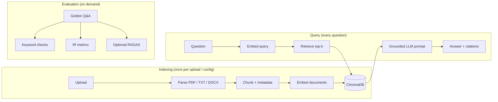

<p align="center">
  
</p>

<h1 align="center">QABot</h1>

<p align="center">
  <strong>Ask questions over your documents. Get grounded answers with citations.</strong><br />
  A Streamlit RAG app with tunable chunking, persistent ChromaDB storage, and built-in evaluation.
</p>

<p align="center">
  <a href="https://github.com/wasimahmadpk/qabot/stargazers"></a>
  
  
  
  
  
</p>

<p align="center">
  <a href="https://github.com/codespaces/new?hide_repo_select=true&ref=main&repo=wasimahmadpk/qabot"></a>
</p>

---

## Table of contents

- [Overview](#overview)
- [Features](#features)
- [Architecture](#architecture)
- [Quick start](#quick-start)
- [Demo walkthrough](#demo-walkthrough)
- [RAG settings](#rag-settings)
- [Evaluation](#evaluation)
- [Programmatic usage](#programmatic-usage)
- [Project structure](#project-structure)
- [Tests](#tests)
- [Troubleshooting](#troubleshooting)
- [Limitations](#limitations)
- [Contributing](#contributing)

## Overview

**QABot** is a [retrieval-augmented generation (RAG)](https://www.llamaindex.ai/blog/retrieval-augmented-generation-rag-from-theory-to-langchain-implementation-4e182cc5468c) app built with Streamlit. Upload PDF, TXT, or DOCX files, ask questions in natural language, and receive **grounded answers with inline source citations**. Vectors persist in **ChromaDB**; embeddings and answers use **OpenAI** via **LlamaIndex**.

| Tab | Purpose |
|-----|---------|
| **Ask Questions** | Upload docs, index into ChromaDB, query with citations |
| **Evaluate RAG** | Run a golden Q&A suite with keyword, IR, and optional RAGAS metrics |

The `src/` pipeline is **UI-agnostic** — the same ingest, index, and query modules can back a REST API, MCP server, or internal help portal.

### Use cases

- **Policy & handbook Q&A** — employees ask HR or IT questions against internal docs
- **RAG prototyping** — tune chunk size, overlap, and top-k without writing boilerplate
- **Regression testing** — measure retrieval and answer quality before shipping prompt or config changes

## Features

- **Multi-file upload** — index several documents in one session (`.pdf`, `.txt`, `.docx`)
- **Tunable RAG settings** — chunk strategy, size, overlap, and top-k from the sidebar
- **Sentence-aware chunking** — respects sentence boundaries by default; token-based splitting also available
- **Grounded prompts** — answer only from retrieved context; cite `[file_name, chunk_id]`; say "I don't know" when evidence is missing
- **ChromaDB persistence** — vectors survive app restarts for the same upload + config signature
- **Upload caching** — SHA-256 signature skips re-embedding when files and chunk settings are unchanged
- **RAG evaluation suite** — latency, retrieval hit rate, answer grounding, and IR metrics (Recall@k, MRR, NDCG@k)
- **RAGAS evaluation** — optional LLM-as-judge metrics (faithfulness, answer relevancy, context recall)
- **Custom eval sets** — upload, edit, or reset evaluation JSON without leaving the app

## Architecture

QABot has three distinct phases. **Indexing** runs when you upload files or change chunk settings. **Querying** runs on every new question and does not re-parse, re-chunk, or re-embed your documents. **Evaluation** runs on demand against a golden Q&A set.



| Step | Module | Role |
|------|--------|------|
| Config | `src/rag_config.py` | Defaults for chunk size, overlap, strategy, top-k; stable index keys |
| Load | `src/loader.py` | Parse PDF (PyMuPDF), TXT, DOCX into LlamaIndex `Document` objects |
| Chunk | `src/chunking.py` | Split documents with overlap; attach `file_name` and `chunk_id` metadata |
| Index | `src/indexer.py` | Embed chunks and persist in ChromaDB (`./chroma_db/`) |
| Prompt | `src/prompts.py` | Grounded QA templates (anti-hallucination rules + citations) |
| Query | `src/query_engine.py` | Retrieve, answer, return latency and source chunks |
| Eval | `src/evaluation.py` | Golden Q&A metrics for retrieval and answer quality |
| Cache | `src/upload_cache.py` | SHA-256 upload signature so unchanged files skip rebuild |

### Models

QABot uses LlamaIndex and RAGAS defaults — no model names are hard-coded in the app.

| Stage | Model | Provider |
|-------|-------|----------|
| Document embeddings | `text-embedding-ada-002` | OpenAI (LlamaIndex default) |
| Answer generation | `gpt-3.5-turbo` | OpenAI (LlamaIndex default) |
| RAGAS judge (optional) | `gpt-4o-mini` | OpenAI (RAGAS default) |

At query time, only the **user's question** is embedded. Stored document vectors are read from ChromaDB.

## Quick start

### 1. Clone and install

```bash
git clone https://github.com/wasimahmadpk/qabot.git
cd qabot

python -m venv venv
source venv/bin/activate          # Windows: venv\Scripts\activate

pip install -r requirements.txt
```

> **Tip:** Prefer zero local setup? Click **Open in GitHub Codespaces** above, add your `OPENAI_API_KEY` as a Codespaces secret, and the dev container installs dependencies and starts Streamlit automatically.

### 2. Configure OpenAI

Create a `.env` file in the project root:

```env
OPENAI_API_KEY=sk-your-key-here
```

### 3. Run the app

```bash
streamlit run app.py
```

Open the URL shown in the terminal (usually `http://localhost:8501`).

## Demo walkthrough

Try the built-in sample in under two minutes:

1. **Start the app** — `streamlit run app.py`
2. **Upload** — on the **Ask Questions** tab, upload `eval/sample_policy.txt` (download it from the **Evaluate RAG** tab if needed)
3. **Wait for indexing** — confirm the success message with document and chunk counts
4. **Ask** — try a sample prompt such as *"How many remote days per week are allowed?"* or *"What is the capital of France?"* (the second should return "I don't know")
5. **Evaluate** — switch to **Evaluate RAG**, click **Run evaluation** for keyword and IR metrics, or **Run RAGAS** for LLM-as-judge scoring

Each new question reuses the stored index. Documents are not re-embedded unless you upload new files or change chunk settings.

## RAG settings

Engineer controls live in the sidebar under **RAG settings (engineer)**:

| Setting | Default | Notes |
|---------|---------|-------|
| Chunk strategy | `sentence` | `sentence` respects boundaries; `token` uses fixed token windows |
| Chunk size | 512 | Target tokens per chunk; triggers re-indexing when changed |
| Chunk overlap | 128 | Shared tokens between neighboring chunks; triggers re-indexing when changed |
| Top-k | 3 | Chunks retrieved per question; applies immediately without re-indexing |

Changing chunk settings creates a new ChromaDB collection keyed by upload signature + config. Use **Reset RAG defaults** to restore defaults.

### Chunking strategies

| Strategy | Splitter | Behavior |
|----------|----------|----------|
| `sentence` (default) | LlamaIndex `SentenceSplitter` | Splits at sentence boundaries up to the chunk size |
| `token` | LlamaIndex `TokenTextSplitter` | Fixed token windows; may cut mid-sentence |

Each chunk receives metadata:

- `file_name` — source document
- `chunk_id` — sequential ID within that file (used in citations)

Short documents that fit within the chunk size stay as a single chunk. Overlap (default 128 tokens) reduces the risk of losing context at chunk boundaries.

## Evaluation

The eval suite runs golden questions from `eval/qa_pairs.json` (or a custom set).

### End-to-end metrics

| Metric | Meaning |
|--------|---------|
| **Retrieval hit rate** | Did retrieved chunks contain all expected keywords? |
| **Grounded answers** | Did the answer include expected facts (or "I don't know" for out-of-scope items)? |
| **Avg latency** | End-to-end query time in milliseconds |

### IR metrics (pure retrieval ranking)

Computed from ranked top-k retrieval **without** running the LLM. All three metrics share the same `top_k` cutoff from sidebar settings.

| Metric | Meaning |
|--------|---------|
| **Recall@k** | Fraction of relevant chunks found in the top-k results |
| **MRR** | Reciprocal rank of the first relevant chunk in top-k (0 if none found) |
| **NDCG@k** | Normalized ranking quality in the top-k list |

### RAGAS metrics (optional)

Click **Run RAGAS** on the Evaluate tab for LLM-as-judge scoring. Requires extra OpenAI API calls.

| Metric | Meaning |
|--------|---------|
| **Faithfulness** | Is the answer supported by retrieved context? |
| **Answer relevancy** | Does the answer address the question? |
| **Context recall** | Does retrieval cover the reference answer? (only when `ground_truth` is set) |

### Eval JSON format

```json
{
  "question": "How many PTO days can carry over to the next year?",
  "expected_keywords": ["5 days"],
  "file_name": "sample_policy.txt",
  "ground_truth": "Up to 5 days of PTO can carry over.",
  "relevant_chunk_ids": [12],
  "refusal": false
}
```

| Field | Purpose |
|-------|---------|
| `expected_keywords` | Facts retrieval and answer checks should contain |
| `file_name` | Optional; restrict checks to a specific source file |
| `ground_truth` | Optional; enables RAGAS context recall |
| `relevant_chunk_ids` | Optional; precise IR metric grading by chunk ID |
| `refusal` | Optional; expects "I don't know" for out-of-scope questions |

Upload custom JSON, edit in the text area, or reset to the default set from the **Eval set & downloads** panel.

## Programmatic usage

The Streamlit UI is a thin wrapper over `src/`. You can drive the same pipeline from a script or API:

```python
from dotenv import load_dotenv
from llama_index.core import Document

from src.indexer import create_index
from src.query_engine import get_query_engine, query_index
from src.rag_config import default_rag_settings, index_config_key

load_dotenv()

docs = [Document(text="Remote work is allowed up to three days per week.", metadata={"file_name": "policy.txt"})]
settings = default_rag_settings()
index_key = index_config_key("demo-upload", settings)

index, stats = create_index(docs, index_key, **{k: settings[k] for k in ("chunk_size", "chunk_overlap", "chunk_strategy")})
engine = get_query_engine(index, similarity_top_k=settings["top_k"])
result = query_index(engine, "How many remote days are allowed?")

print(result["answer"])
print(result["sources"])  # file_name, chunk_id, text, score
```

For retrieval-only benchmarks (no LLM cost), use `retrieve_ranked()` from `src/query_engine.py`.

## Project structure

```
qabot/
├── app.py                 # Streamlit UI (Q&A + evaluation tabs)
├── assets/logo.png
├── eval/
│   ├── qa_pairs.json      # Golden Q&A for evaluation demo
│   └── sample_policy.txt  # Enterprise-scale sample handbook
├── src/
│   ├── rag_config.py      # RAG defaults and index key helpers
│   ├── loader.py
│   ├── chunking.py
│   ├── indexer.py
│   ├── prompts.py
│   ├── query_engine.py
│   ├── evaluation.py
│   └── upload_cache.py
├── tests/
│   ├── test_rag_config.py
│   ├── test_upload_cache.py
│   ├── test_chunking.py
│   └── test_evaluation.py
├── chroma_db/             # Created at runtime (gitignored)
├── requirements.txt
└── .env                   # Not committed — add OPENAI_API_KEY locally
```

## Tests

```bash
python -m unittest discover -s tests -v
```

Unit tests cover chunking, upload cache signatures, RAG config keys, and evaluation logic — no OpenAI API key required.

## Troubleshooting

| Issue | Fix |
|-------|-----|
| `OPENAI_API_KEY` errors | Add the key to `.env` in the project root and restart Streamlit |
| Index rebuilds on every rerun | Ensure you uploaded files in the current session; the app caches by upload signature + chunk config |
| Empty or garbled PDF text | PDFs must contain selectable text; scanned images need OCR (not included) |
| Slow first query | Initial OpenAI and ChromaDB warm-up is normal; subsequent queries reuse the stored index |
| RAGAS fails or times out | RAGAS makes extra LLM calls per question; check API quota and network access |
| `Metadata length is longer than chunk size` | Increase chunk size in sidebar settings — metadata counts toward the token budget |

## Design decisions

**Chunking (512 / 128)** — balances recall (enough context per chunk) with precision (smaller chunks reduce irrelevant retrieval noise). Overlap avoids cutting sentences at boundaries.

**Grounded prompts** — the LLM must answer only from retrieved context and refuse when evidence is missing. This directly targets hallucination reduction.

**ChromaDB** — persistent vector storage keyed by upload signature and chunk config. Restarting Streamlit does not require re-embedding the same files with the same settings.

**Separate indexing and query paths** — document embeddings are stored once; each question only embeds the query, retrieves from ChromaDB, and calls the LLM.

**Evaluation** — keyword checks and IR metrics are lightweight and deterministic. RAGAS adds LLM-as-judge scoring for deeper quality signals. Together they support regression testing without manual review on every change.

## Limitations

- **No auth** — intended for local or trusted use only
- **PDF quality** — text extraction depends on PDF structure; scanned images need OCR (not included)
- **OpenAI by default** — swap embedding/LLM settings for local models (e.g. Ollama) in a follow-up
- **Dense retrieval only** — no BM25, hybrid search, or reranking
- **Eval keywords** — simple substring checks; RAGAS helps but neither replaces human grading at scale
- **Cost** — indexing, queries, and RAGAS evaluation use OpenAI API credits

## Dev container

A `.devcontainer/` config is included for VS Code and GitHub Codespaces. On attach, it installs dependencies from `requirements.txt` and starts Streamlit on port 8501.

## Contributing

Issues and pull requests are welcome on [GitHub](https://github.com/wasimahmadpk/qabot).

## Author

[wasimahmadpk](https://github.com/wasimahmadpk)
